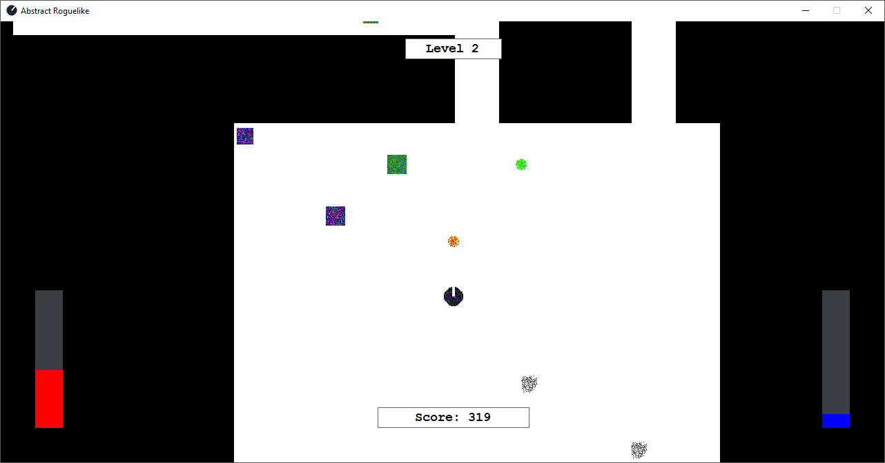

# AbstractRoguelike

A basic roguelike/shooter game built in .nte Visual C++ on Windows Forms, using Visual Studio 2013 and 2015.    
Coded for Programming 4, semester 2, 2016.

## Build

<a href="Builds/AbstractRoguelike.zip">https://github.com/kellybs1/AbstractRoguelike/blob/master/Builds/AbstractRoguelike.zip?raw=true</a>    
Extract zip, double click exe to play. Folders"maps" and "images" must be in same directory as executable

## Screenshot

## Manual

https://github.com/kellybs1/AbstractRoguelike/blob/master/Abstract%20Roguelike%20Game%20Manual.pdf

ps Press P tp cheat up a level
